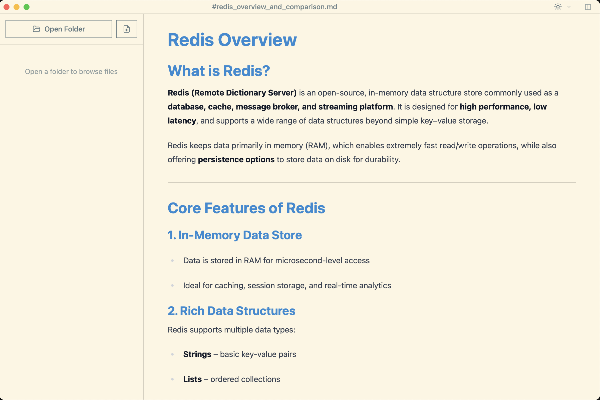
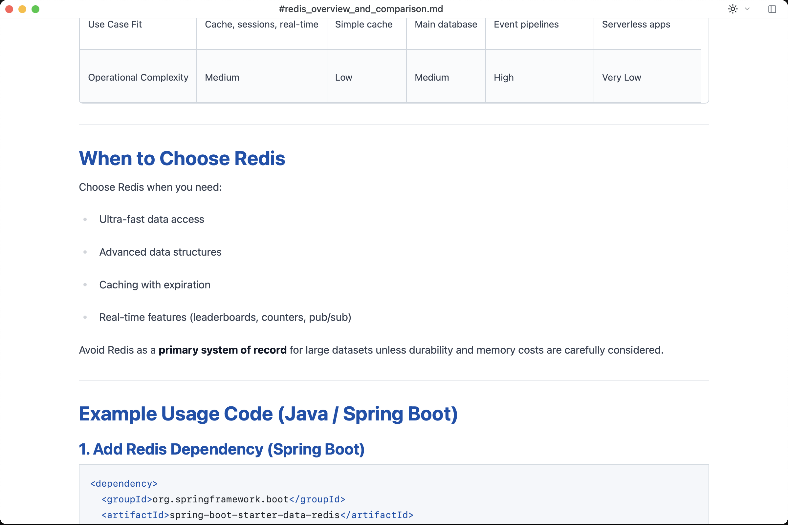

# Tauri WYSIWYG Markdown Editor

A modern, desktop Markdown editor built with [Tauri](https://tauri.app/), [React](https://react.dev/), and [Tiptap](https://tiptap.dev/). Edit Markdown documents with a beautiful WYSIWYG interface and rich text formatting.

## Screenshots

<table>
  <tr>
    <td></td>
    <td></td>
  </tr>
</table>

## Features

- **WYSIWYG Markdown Editing** - Edit Markdown with a visual interface powered by Tiptap v2
- **Table Support** - Full GFM markdown table support with visual editing and resizable columns
- **File Management** - Open, save, and manage Markdown files with native file dialogs
- **Rich Text Formatting** - Support for bold, italic, lists, code blocks, blockquotes, and more
- **Auto-save** - Automatically save your work at regular intervals
- **Recent Files** - Quick access to recently opened documents
- **Theme** - Supported UI themes: GitHub Light, GitHub Dark, Dracula, Nord Light, Nord Dark, Solarized Light, Solarized Dark

## Tech Stack

- **Frontend**: React 18 + TypeScript
- **Editor**: Tiptap v2 with extensions
- **Desktop**: Tauri v2
- **State Management**: Zustand
- **Styling**: Tailwind CSS
- **UI Components**: Custom components with shadcn/ui patterns
- **Build Tool**: Vite

## Getting Started

### Prerequisites

- [Node.js](https://nodejs.org/) (v16 or later)
- [pnpm](https://pnpm.io/) (or npm/yarn)
- [Rust](https://www.rust-lang.org/) (for Tauri desktop builds)

### Development

Start the development server with hot reload:

```bash
pnpm dev
```

For Tauri-specific development:

```bash
pnpm tauri dev
```

### Building

Create an optimized production build:

```bash
pnpm build
```

Create the desktop application:

```bash
pnpm tauri build
```

## Project Structure

```
├── src/                          # React frontend
│   ├── components/              # React components
│   │   ├── Editor/             # Main editor component
│   │   ├── Toolbar/            # Formatting toolbar
│   │   ├── Sidebar/            # File browser sidebar
│   │   └── ui/                 # Reusable UI components
│   ├── stores/                 # Zustand store configuration
│   │   ├── documentStore.ts   # Document state management
│   │   ├── settingsStore.ts   # User settings
│   │   └── uiStore.ts         # UI state
│   ├── hooks/                  # Custom React hooks
│   └── App.tsx                 # Root component
├── src-tauri/                  # Tauri backend
│   ├── src/                    # Rust backend code
│   └── tauri.conf.json        # Tauri configuration
├── index.html                  # Entry HTML
├── vite.config.ts             # Vite configuration
├── tailwind.config.js         # Tailwind configuration
└── package.json               # Dependencies
```

## Scripts

- `pnpm dev` - Start Vite development server
- `pnpm build` - Build frontend with TypeScript checking
- `pnpm preview` - Preview production build
- `pnpm tauri` - Run Tauri CLI commands

## License

MIT
